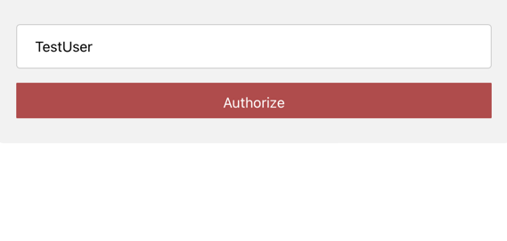
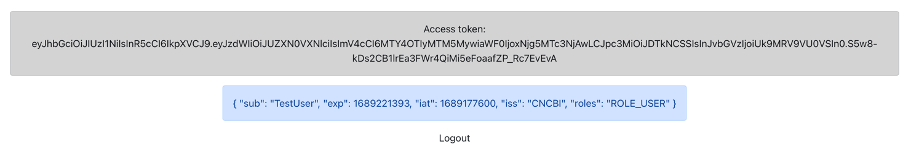

# Frontend - QR Code Login with WebSocket


### How to run


 #### install the packages

```bash
  npm install
```

#### run
    
```bash
  npm start
```


### STEP 1: (Web) Scan the QR Code by mobile / Click the Code


### STEP 2: (Mobile) Input the Logged in User in mobile / browser




### STEP 3: (Web) Browser redirect to the home Page with issued Token


#### Done.

